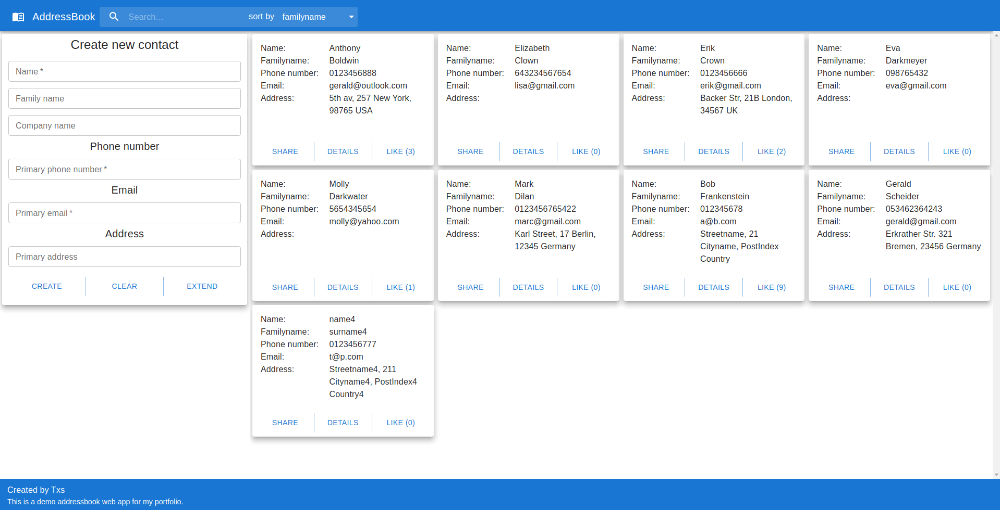

<h1>Address book web app</h1>

The purpose of this app is to get real practice in the development of the complete web application based on MERN stack.

Functionally wise, the application is a simple address book with the possibility to search and sort contacts depending on user's need.

Web app provides standard functionality with the possibility to create, view, edit and delete contacts.

Search function immediately filters all the contacts and shows only those, which contain search phase in any contacts' fields.

Sorting function provides user the possibility to sort contacts according to contacts' name, familyname, number of previous searches / likes or its creation date.

When user clicks 'DETAILS' button, its likes counter goes 1 up. User also can 'like' any contact manually.

'SHARE' button copies all the contact details to the clipboard.

<h1></h1>

The following components are used  in this web app:

Backend

<ul>
<li>Node JS</li>
<li>Express</li>
<li>MongoDB</li>
</ul>

Frontend

<ul>
<li>React</li>
<li>React Redux</li>
<li>Axios</li>
<li>MUI for styling</li>
</ul>
<h1></h1>

What is going to be added somewhen:

<ul>
<li>Information and error messages according to what happens to the app. Currently there is only one message after user clicks 'SHARE' button and contact details are copied to the clipboard.</li>
<li>Another views for the contact list (i.e. as a table).</li>
<li>Contacts import / export function.</li>
<li>Dark theme and a switcher between light / dark theme.</li>

<h1></h1>

